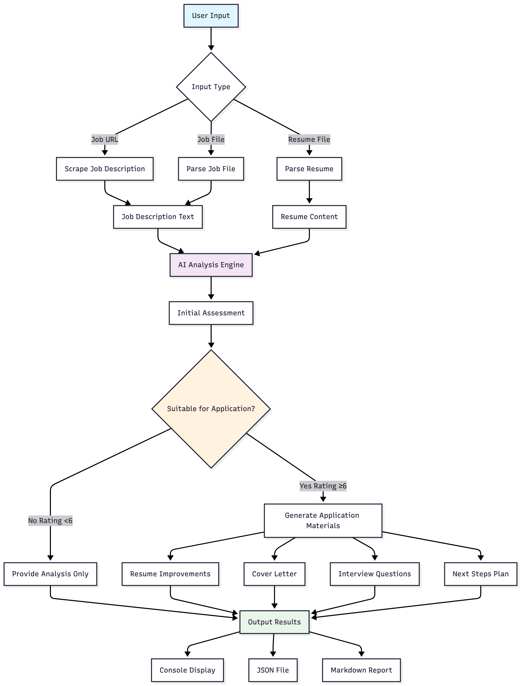

# Job Application Agent

An AI-powered analysis tool that assesses suitability to a specific job (based on provided job description and resume) and provides comprehensive recommendations for next steps.

## ⚠️ Important: This is NOT an automated job application tool

This agent **analyzes and provides recommendations**

**What it does NOT do:**
- ❌ Automatically apply to jobs
- ❌ Scrape job listings from websites
- ❌ Submit applications on your behalf
- ❌ Fill out job application forms

**What it DOES do:**
- ✅ Analyzes job fit and provides suitability ratings
- ✅ Generates tailored application materials
- ✅ Prepares you for interviews
- ✅ Helps you decide which jobs to apply for

## Features

- **Smart Analysis**: Rates job suitability on a 1-10 scale with detailed breakdown
- **Multiple Input Formats**: Supports job descriptions from URLs or files, resumes in text, Markdown, Word, or PDF formats
- **AI-Powered**: Uses Claude or Ollama for intelligent analysis
- **Comprehensive Output**: Generates resume improvements, cover letters, interview questions, and action plans
- **Resume Optimization**: ATS compatibility analysis, resume scoring, and improvement recommendations
- **Application Tracking**: SQLite database for tracking job applications, status updates, and analytics
- **Career Analytics**: Career progression tracking, industry trend analysis, and personalized recommendations
- **LangChain Integration**: Advanced AI workflows with structured outputs, RAG, and iterative optimization
- **Structured Output Parsing**: Robust JSON-first parsing with regex fallback for reliable data extraction
- **Error Handling & Retry Logic**: Automatic retry with exponential backoff for LLM API calls
- **Resume Caching**: Automatically caches parsed resume content for faster subsequent analyses
- **MCP Server**: Can run as Model Context Protocol server for AI assistant integration
- **Auto Markdown**: Automatically generates Markdown reports when using JSON output
- **Straightforward CLI**: Rich console output with progress indicators and formatted results
- **Encrypted Caching**: GDPR-compliant data encryption with multiple authentication methods

## Installation

1. Clone the repository:
```bash
git clone https://github.com/balain/job-application-agent.git
cd job-application-agent
```

2. Install `uv` (optional but recommended) - https://docs.astral.sh/uv/

3. Install dependencies:
```bash
uv sync
```
or

```bash
pip install -e .
```

4. Set up environment variables:
```bash
cp .env.example .env
# Edit .env with your API keys
```

See [Configuration Guide](docs/CONFIG.md) for detailed setup instructions.

## Quick Start

If using `uv`:
```bash
uv run main.py --job "https://example.com/job-posting" --resume resume.docx
```

or, with plain python:

```bash
python main.py --job "https://example.com/job-posting" --resume resume.docx
```

## Documentation

- **[Usage Guide](docs/USAGE.md)**: Complete command reference and usage examples
- **[Configuration Guide](docs/CONFIG.md)**: Environment variables and configuration options
- **[Architecture & Technical Details](docs/ARCHITECTURE.md)**: Technical deep-dives and implementation details
- **[Dependencies](docs/DEPENDENCIES.md)**: Complete dependency list and requirements

## Requirements

- Python 3.13+
- Anthropic API key (for Claude) or Ollama (for local models)

See [Dependencies](docs/DEPENDENCIES.md) for the complete list of required packages.

## Additional Resources

- **[FUTURE.md](FUTURE.md)**: Roadmap and future development plans
- **[GRAPH_DB_ALTERNATIVES.md](GRAPH_DB_ALTERNATIVES.md)**: Graph database comparison and alternatives
- **[NEO4J_SETUP.md](NEO4J_SETUP.md)**: Neo4j setup instructions

## License

This project is licensed under the MIT License - see the [LICENSE.md](LICENSE.md) file for details.

## Flow

The Job Application Agent follows a structured workflow to analyze job applications:


